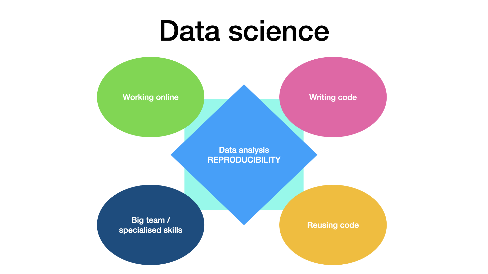

::::::::::::::::::::::::::::::::::::::: objectives

- Understanding the scope and structure of this course.
- Contextualising computational project management for biomedicine and life science research.
- Knowing the next steps to take after this workshop.

::::::::::::::::::::::::::::::::::::::::::::::::::

:::::::::::::::::::::::::::::::::::::::: questions

- How does this training relate to your work?
- What are the benefits of using data science skills in research project management?
- What are common challenges for research teams and research project management?

::::::::::::::::::::::::::::::::::::::::

  

## Overview of this training material

This chapter gives you an overview of the topics of this course.
It also corresponds to specificity of data science work.
They are not treated in the same order as indicated here.

This program will teach you best practices in data science project management and how to appyly them to research project.
This material will help you to manage a research project that comprise some *online collaborative working*,
has a relatively *big team, where people have complementary skills*,
use *coding or programming*, as well as the *reuse of code*,
and last but not least, aim at producing a *reproducible analysis*, as is pictured below.

Here we give an short overview of the topics that will be covered in this course.
Note that the course episode split follows a  different logic, and you will find training linked to each five of these data science specifics in most episodes.

:::::::::::::::::::::::::::::::::::::::::  callout

### Team and data science

The principles taught in this course can be applied to any research project.
It will help project manager to work with online tools, with people with specialised skillsets,
and with a project involving some code writing and code reuse.
The goal is to produce a reproducible data analysis in modern research context.

It requires some specific and some non-specific project management actions.
This course covers a large panel of action to perform before, during and after the project is conducted.

::::::::::::::::::::::::::::::::::::::::::::::::::

### Online work

When part of the work happens online, it becomes very easy to loose track of what documents are where,
what tools were used (by whom), and who is doing what.
Discussions are also more difficult to organise and meetings are more complex to drive.
In this course, we will look at different elements that make this work easier.

Af first, there should be one entry point for the project, where every team member can find the main documentation as well as links to other documents and data.
This starts with setting `one main URL` when setting up the project, as well as using good readme files and templates. The information needs to be updated during the project and shared with the whole team.

The use of online project management tool (like kaban boards for todo list) can also help members of the team to coordinate their work, and follow their achievements.

### Team science

Because teams can be big, and quite heterogeneous in terms of skills (especially computer and programming skills), it is important to follow best practice of team building.

In particular, one should set reasonable goals and milestones for the project, and document them in the main documentation.
It is also important that every team member knows what his part is, and that the work is well distributed.

One should make sure every team member is able to use the communication tools set for the team, and take particular care of the organisation of meetings. Data and code should be documented (and this documentation work should be fostered), such that every team member can follow and reuse the work of the other team members.

### Coding

When data analysis is done via a programming language, things become mostly easier, but this facility has some drawbacks, as well as some effects on data management practice.

First, a data analysis workflow will now start with the computer reading the raw data.
This means that the choice of the data format for the raw data may change, and that manually gathered data should be (easily) computer readable.
This is particularly important for spreadsheets, as a lot of time can be saved by designing the spreadsheet in a tidy format.

Second, statistical analysis and data representation in figures will now be much easier to perform, making p-hacking and harking practices very easy to do, even involuntarily. Researcher have to actively make sure their analysis is not flawed.

Third, making errors in the code may have larger effects than making error in a manual analysis.
However, errors are easier to spot (doing code reviews and tests) and when the code is corrected, the results are immediately corrected, too.

### Code/data publication and reuse

Very soon in a research project, writing code consist mostly of taking code written by someone else and applying it (with some tweaks sometimes) to one own data.
We will look at ways to find relevant code, make sure it can be trusted, make sure you can legally use it, and ways to cite it (to give recognition the initial software engineer deserves).

In addition, code written in the project will probably be reused, too.
We will look into best practices to make this reuse easier, both in how the code is written (modularity, documentation, tests) and in how the code is shared (license, repository, version control, release, users instruction, developers instructions).

### Reproducibility

At the core of data science, the analysis reproducibiliy is both a goal and a huge advantage (in terms of research transparency, trustworthiness and work efficiency).
The use of code is not enough to get a reproducible analysis, one needs to have access to both the code and the data used to produce the research result, a concept called provenance.
This may not be trivial, especially if several version of the code and of the data exist.

In this course, we will have a strong emphasis on version control, while we will introduce the concepts (and some tools) of provenance, as well as literate programming (reproducible reports and executable papers), where the code, the figure and explanatory text are bound in the same file.

:::::::::::::::::::::::::::::::::::::::: keypoints

- This course will help you manage team work that involves coding, using digital tools.
- One objective is to produce reproducible analysis and a more transparent research.

::::::::::::::::::::::::::::::::::::::::::::::::::

    

---

  

## Your research project is a computational project.

::::::::instructor

This chapter about motivation can be used to convince people to sign up to the course.
It can also be used as a small starter for each lessons.
::::::::

As a researcher, you are likely to use some sort of computational tools to process, analyse, and visualise data.
You are also likely to work on your project with other members of the lab, and the success of your work may well depend on your interactions with your peers.
**In that sense any research project can be defined as a collaborative, computational project.**

*We all may have dfferent research and data science expertise. The Turing Way project illustration by Scriberia for The Turing Way Community Shared under CC-BY 4.0 License. Zenodo. [http://doi.org/10.5281/zenodo.3332807](https://doi.org/10.5281/zenodo.3332807)*

::::::::::::::::::::::::::::::::::::::  discussion

## Why are you here

Discuss why you/learners are taking this course, what are the expectations.
Does the expectations align with the relevance of data science and content of this course?

::::::::::::::::::::::::::::::::::::::::::::::::::

Contents of this training material introduces methods and concepts to manage individuals and teams working on any computational project, which in the current era is literally all research projects.
It is *not* about learning how to write code, but building a foundational understanding for computational methods that could be applied to your research.
Furthermore, this training will provide guidance for facilitating collaboration and data analysis using tools like research data management, version control or code review.

We acknowledge the data science knowledge will vary.
Nonetheless, we believe that the data science skills you will learn in this training will make your research process better. In the following sections, we will detail what we mean by "better".

## How data science will improve your research ?

*Data science makes research flourish. The Turing Way project illustration by Scriberia for The Turing Way Community Shared under CC-BY 4.0 License. Zenodo. [http://doi.org/10.5281/zenodo.3332807](https://doi.org/10.5281/zenodo.3332807)*

:::::::::::::::::::::::::::::::::::::::::  callout

## It is mostly about being efficient

Data science brings some structure in how data is collected, processed and analysed, making it easier to collaborate on a project, to publish extra research outputs and leveraging some extra potential your data may have.
In the past, it helped me drive new hypotheses, detect problems with the research design early, and reduce the sample size needed to drive a solid conclusion.
Eventually, it made my research more robust and trustworthy.
But in the end, my real motivation is efficiency: very soon, the time I invested in learning and applying data science in my research was recovered multiple times when a manuscript had to be written (and re-written).

::::::::::::::::::::::::::::::::::::::::::::::::::

There are different ways to organise the different foreseen improvement, we decided here to start with improvement in the final result, improvement in the research process, and finally aspects of community building.

### Using code for nicer paper

#### Powerful statistics

The most advanced statistical methods (like machine learning) are first developed in programming environment, and they are often difficult or impossible to implement in statistical software.
In addition, some of the less advanced statistical methods requires intensive data processing that makes it very difficult to apply outside a coding environment.

##### Examples

1. [logarithmic.net/langevitour/2022-useR/#2](https://logarithmic.net/langevitour/2022-useR/#2) to explore orthonormal projections of high dimensional data.
2. Results of water maze behavioural tests are better analysed using a survival analysis than an [Analysis of variance (ANOVA)](https://en.wikipedia.org/wiki/Analysis_of_variance).
  However, the data obtained via video analysis software is often not fitted for that analysis and needs to be transformed. Doing transformations by hand is time consuming and is likely to introduce errors.

**Example's references**

- See *Jahn-Eimermacher, A., Lasarzik, I., \& Raber, J. (2011). Statistical analysis of latency outcomes in behavioral experiments. Behavioural Brain Research, 221(1), 271–275. doi: [10\.1016/j.bbr.2011.03.007](https://www.sciencedirect.com/science/article/abs/pii/S0166432811001847?via%3Dihub)*
- For water maze experiment analysis, see: Maugard, M., Doux, C., \& Bonvento, G. (2019). A new statistical method to analyze Morris Water Maze data using Dirichlet distribution. F1000Research, 8(1601), 1601. doi: [10\.12688/f1000research.20072.2](https://doi.org/10.12688/f1000research.20072.2).

#### Informative (and inclusive) figures

Once you start using code for analysing your data, it will become much easier to do complex and informative visualisation.
This often includes way to visualise and label single data points, or use  visualisation on several dimensions (producing moving gifs of a 3D scatterplot for instance).

One can also automate the figure design choice, so that all figures look similar.
Similarly, the production of several version of the same figure is very easy.
For example, one can use different color pallette, one using the palette usually used in the field (the one your supervisor wants to see), and one for color-blind readers.

:::::::::::::::::::::::::::::::::::::::::  callout

## Single flights from different bees.

See a good example of data representation in differen format single flights from different bees shown in supplemnentary data: *Menzel, R., Greggers, U., Smith, A., Berger, S., Brandt, R., Brunke, S., ...Watzl, S. (2005). Honey bees navigate according to a map-like spatial memory. Proceedings of the National Academy of Sciences of the United States of America, 102(8), 3040. doi: [10\.1073/pnas.0408550102](https://www.ncbi.nlm.nih.gov/pmc/articles/PMC549458/)*

::::::::::::::::::::::::::::::::::::::::::::::::::

#### Reproducible analysis

Good scientific practices are aiming at securing the robustness and reproducibility of the scientific endeavour.
As a researcher, assuring computational reproducibility of your results is a relatively easy step in making your research more robust.

*What to expect in your reproducibility journey. The Turing Way project illustration by Scriberia for The Turing Way Community Shared under CC-BY 4.0 License. Zenodo. [http://doi.org/10.5281/zenodo.3332807](https://doi.org/10.5281/zenodo.3332807)*

The reproducibility of an experiment not only requires a detailed description of the methods and reagents used, but also a detailed description of the analysis performed.
The ultimate description of the analysis is to provide all elements necessary for reproducing the analysis (computational reproducibility).
This includes the data and the code used to analyse it (in a form that can be reused in a different computational environment).

:::::::::::::::::::::::::::::::::::::::::  callout

In practice, sometimes one may not be able to provide all elements openly (for instance, some medical data cannot be shared openly for privacy reasons) for everyone to be able to reproduce all the results.
But co-workers (and maybe reviewers) should be able to reproduce the analysis (e.g., on anonymized data).

::::::::::::::::::::::::::::::::::::::::::::::::::

The emergence of reproducible reports is another aspect of computer reproducibility.
Literate programming using Jupyter notebooks, Rmarkdown, stencila or quarto (tools that can usually use Python, R, or Julia) is indeed growing in popularity.
These tools allow you to show data and analysis side by side, with written explanations and interactive visualisations.
These outputs can not only be used as blog posts, or lab reports, but can also be published as an enhanced publication, a concept called executable research articles: [https://gmaciocci.medium.com/list/the-evolution-of-executable-research-articles-823e42a9fa60](https://gmaciocci.medium.com/list/the-evolution-of-executable-research-articles-823e42a9fa60)

#### Diversifying research outputs

While the main recognition currency in academia is still (first) authorship in peer reviewed publication, new scientometrics are developed to recognize publication of other research outputs.
In particular, datasets and software publication are officially reviewed in the evaluation of certain grant, for example for the Marie-curie european program.
Data science principles will make it easier to publish datasets, software, reagents or hardware you are anyway producing during the research process.

:::::::::::::::::::::::::::::::::::::::::  callout

By publishing datasets and code, you will not only help other researchers, but gain extra recognition for your work.
However, open data and open code requires a specific documentation, which we will touch upon in this training.

::::::::::::::::::::::::::::::::::::::::::::::::::

Computational tools you produce in your lab can be released as open source software and credit will be given globally.
This may also be true for hardware you design (this aspect will not be discussed in this training) or datasets you collect.

### Improved Research Process

#### Data quality

Did you know that manually copy-pasting data is one of the primary source of data corruption ?
Combining datasets or processing data (such as cleaning or transforming into different formats), can therefore be best achieved using code.
The process is not only safer, but it is often faster.

Another underevaluated issue is the amount of data you will collect.
The more data you have the more sophisticated tools and workflows you may need.
It is also more likely that your data (or code) gets corrupted, mixed up, outdated, or lost.
In particular, when something goes wrong during the experiment, code might be used to create warnings, so that the setup or protocol may be modified on the fly or between sessions.

#### Reproducibility and automation

While we already mentioned the advantage of reproducibile analysis for the quality of the research, we did not mention how useful this is during the research.
With reproducible analysis, it is effortless to run a new dataset in the analysis workflow,
it becomes possible to explore the data at a single experiment level, which may enable new hypotheses, or spot issues that were not foreseen in the experimental design.
It makes also certain that difference in the figures are due to difference in the dataset, not any manual processing of the data one may have forgotten to docuzment.

#### Collaborative working

Within science teams, group work is critical for experimental design and implementation.
In addition, there are rapid developments in how scientific results and methods are shared, and collaborations have never been more global or rapid.
This means that several people will likely be working with the same data files.

Data science allows for the management of
how one or multiple people work on the same project (as well as the same code).
It requires different skillsets than those taught in traditional science courses *or* a typical coding class.

::::::::::::::::::::::::::::::::::::::  discussion

## Who can add to your research?

Facilitating communication and sharing will make it easier for your colleagues to help you.
Can you think of people who can help you in your research, directly in your lab or at your institution ?
Would it help for them to have access to your data? How could they participate,
and how can you give them credit?

:::::::::::::::  solution

## Needs from the future you

It is very interesting to consider your future self as one collaborator in your project.
Anything you may forget in the next three to five years should be documented,
if you want your future self to be able to (re-)analyse the data you are collecting.
Indeed, the advantage of working collaboratively in a project can indeed be translated directly in a project you drive mostly alone.

:::::::::::::::::::::::::

::::::::::::::::::::::::::::::::::::::::::::::::::

#### Efficiency

:::::::::::::::::::::::::::::::::::::::::  callout

The time invested in your data and code will be paid multiple times by the efficiency improvement in your workflow, if that investment is done early in the project.
Because one can consider your past self as one of your collaborator, the advantage of working collaboratively in a project can indeed be translated directly in a project you drive mostly alone.

::::::::::::::::::::::::::::::::::::::::::::::::::

At this point, you may be convinced that the extra work of designing your project using data science principles will be worth it.
But here comes the best argument of all: **in the end you will save time.**
Early time saving comes because your future self and collaborators will be able to find all your data, reuse and modify your code, and understand your research faster.

This applies directly to the example of working on article revisions - will you still remember all the analysis details and data nuances when your papers comes back with a request for major changes?
For instance, if a colleague cannot find what data goes with which figures, there are high chances that you will also be unable to find it three years from now.
In addition, itt is not uncommon to modify the design of the figures multiple times (sometimes back and forth), often modifying all figures at once.

:::::::::::::::::::::::::::::::::::::  testimonial

## Redoing all figures in minutes

Once a reviewer ask me to overlay individual data points onto all our 5 boxplots figures.
The project was an old one, and I had not touched the data for years.
Finding the right data and redo the all 5 figures would usually take ages using SPSS or excel.
But since I used code, I had all figures 15 minutes later.
(Note, after seeing the new figures, the reviewer agreed that the original version was better).

::::::::::::::::::::::::::::::::::::::::::::::::::

Later on in the project, community advantages are coming in.
Data and code reusability is not only a mark of research transparency and robustness, it also means you can reuse your own code and data.
It also means you can reuse code and data produced by other researchers.

The snow ball effect may be huge, and the objective of this course is to allow you to do **better science in less time**

:::::::::::::::::::::::::::::::::::::::::  callout

## Invest in data science

As an example it was estimated that research data management  takes about 5% of your time, on the other hand, time lost due to poor data management is estimated to be 15%.
See reference: *Lowndes, J. S. S., Best, B. D., Scarborough, C., Afflerbach, J. C., Frazier, M. R., O'Hara, C. C., Halpern, B. S. (2017). Our path to better science in less time using open data science tools. Nature Ecology \& Evolution, 1(0160), 1–7. doi: 10.1038/s41559-017-0160*

::::::::::::::::::::::::::::::::::::::::::::::::::

### Team and community building

*Data science foundations. The Turing Way project illustration by Scriberia for The Turing Way Community Shared under CC-BY 4.0 License. Zenodo. [http://doi.org/10.5281/zenodo.3332807](https://doi.org/10.5281/zenodo.3332807)*

Data science tools will make it easier not only to collaborate with researchers in your lab, but also with researchers outside of your lab, or even with non-researchers (citizen science or software professionals).
These may bring valuable expertise in the project.
Being part of a collaborative community will also create impact beyond citations and papers, something which starts to be valued by funding agencies, and which make research more fun, valued and interesting.

We may also add to the pot that creating a network around your research is a critical aspect of building a career in academia.
Being known as a good and skilled collaborator can open doors to many opportunities.

## A journey starts

> You step into the Road, and if you don't keep your feet, there is no knowing where you might be swept off to.
> 
> J.R.R. Tolkien, The Lord of the Rings

This training will give you some starting points, but implementating data science principles is a long and always renewed process.
But you do not need to do it all at once, and you do not need to do it alone.

After the training, do not hesitate to join (or create) a community of like-minded researchers where you live (there are always some if you look).
In addition, there may be people at your institution whose job is to help you.
Look for data steward or data managers, research data engineers, IT support, open science büros at your institution and be pro-active contacting them.
There are also almost endless online resources and helpful communities.
For instance, *The Turing Way* guide for data science and research provides several detailed chapters to cover topics across reproducibility, project design, collaboration, communication, research ethics and community building.

*The Turing Way project illustration by Scriberia for The Turing Way Community Shared under CC-BY 4.0 License. Zenodo. [http://doi.org/10.5281/zenodo.3332807](https://doi.org/10.5281/zenodo.3332807)*

:::::::::::::::::::::::::::::::::::::::: keypoints

- The course provides an introduction to Managing Open and Reproducible Computational Projects to senior biomedical researchers, in order to equip them with tools and techniques to generate and document and manage complex reproducible computational projects.

- Without going into underlying technical details, the contents provide a general overview and present selected relevant biomedical case studies.

::::::::::::::::::::::::::::::::::::::::::::::::::

