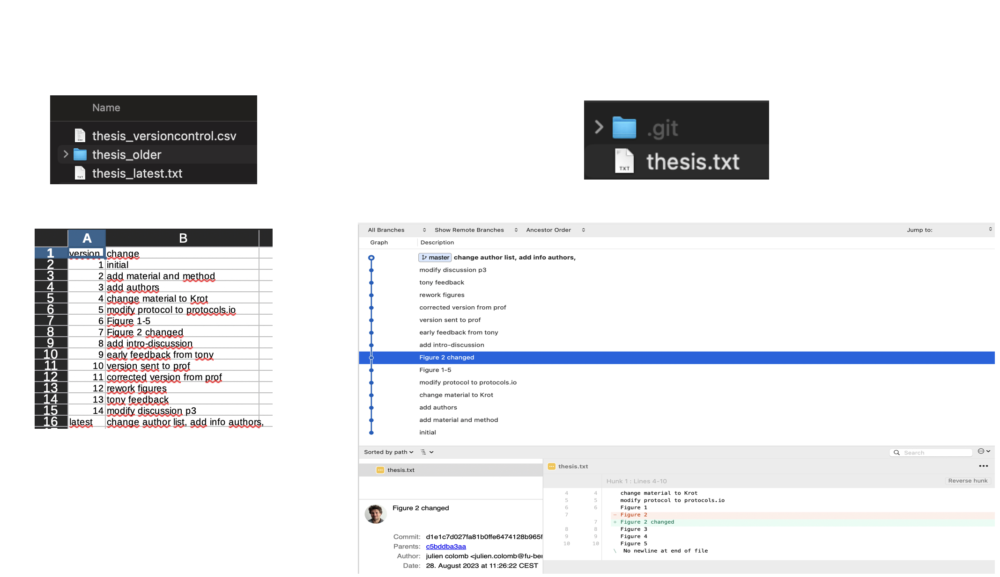

::::::::::::::::::::::::::::::::::::::: objectives

- Understand the different concepts related to reproducibility.
- Learn about methods to capture reproducible research environments.
- Understand the concept of provenance and version control.
- Understand the power and pitfalls of Git

::::::::::::::::::::::::::::::::::::::::::::::::::

:::::::::::::::::::::::::::::::::::::::: questions

- How to build reproducible analysis?
- how to deal with dependencies?

- What is version control?
- Why using git ?
- How is version control system relevant for biomedical research?

::::::::::::::::::::::::::::::::::::::::::::::::::

## What is computer reproducibility

{alt='A matrix showing data and analysis in two axis and iterating that reproducibility is when same analysis is applied to same data it gives same result.'}

*Documentation as a guiding light for people who may feel lost otherwise. The Turing Way project illustration by Scriberia for The Turing Way Community Shared under CC-BY 4.0 License. Zenodo. [http://doi.org/10.5281/zenodo.3332807](https://doi.org/10.5281/zenodo.3332807)*

The different dimensions of reproducible research described in the matrix above have the following definitions directy taken from *The Turing Way* Guide to Reproducible Research (see the [oveview chapter](https://the-turing-way.netlify.app/reproducible-research/overview.html)):

- **Reproducible:** A result is reproducible when the *same* analysis steps performed on the *same* dataset consistently produces the *same* answer.
- **Replicable:** A result is replicable when the *same* analysis performed on *different* datasets produces qualitatively similar answers.
- **Robust:** A result is robust when the *same* dataset is subjected to *different* analysis workflows to answer the same research question (for example one pipeline written in R and another written in Python) and a qualitatively similar or identical answer is produced.
  Robust results show that the work is not dependent on the specificities of the programming language chosen to perform the analysis.
- **Generalisable:** Combining replicable and robust findings allow us to form generalisable results.
  Note that running an analysis on a different software implementation and with a different dataset does not provide *generalised* results.
  There will be many more steps to know how well the work applies to all the different aspects of the research question.
  Generalisation is an important step towards understanding that the result is not dependent on a particular dataset nor a particular version of the analysis pipeline.

## Provenance and reproducibility

In order to make results reproducible, one needs to access and reuse the data and the code used to produce the analysis. 
Since both code and data may evolve over time (errors may be found, variables may be changed), it is important to link the figure created with a specific version of the code and the data, this is called keeping provenance information.

{alt='A figure explaining the concept of provenance: Silos labeled raw data, preprocessed data, analysis, and paper are connected and points representing data are flowing from the first to the last silo.'}

## Long term reproducibility

Both data and software should be in a form where the analysis can run on a different hardware.
Because software evolve quite rapidly, it may be difficult to have the analysis run years after its creation, because the dependencies will have evolve and may not be compatible with the old code anymore. 

It is therefore important to know what version of the dependencies were used. 
In practices, there are specific tools to record dependencies, and for complex code,
it is preferable to use countainers.
Containers are specific piece of software that "contain" all the information and dependences needed to run a code. 

Alternatively, one can aim at robustness and document the analysis enough such that adapting the code to a new computer environment is easy. 
This may be a easier workflow for simple analysis.

Thinking about which software, tools and platforms to use will greatly affect how you analyse and process data, as well as how you share your results for computational reproducibility.
The idea is to facilitate others in recreating the setup process necessary to reproduce your research.

:::::::::::::::::::::::::::::::::::::::::  callout

## Some tools that can be used to enable these are the following:

- **Dependency managers** such as [Conda](https://docs.conda.io/en/latest/) keep dependencies updated and make sure the same version of dependencies used in the development environments are also used when reproducing a result.
- **Containers** such as [Docker](https://www.docker.com/) is a way to create computational environments with configurations required for developing, testing and using research software isolated/independent from other applications.
- **Literate Programming** using [Jupyter Notebook](https://jupyter.org/) is an extremely powerful way to use a web-based online interactive computing environment to execute code and script while adding notes and additional information about the application.
  
  

::::::::::::::::::::::::::::::::::::::::::::::::::

### Reproducible Research Environment

Researchers' working environments evolve as they update software, install new software, and move to different computers.
If the project environment is not captured and the researchers need to return to their project after months or years (as is common in research), they will be unable to do so confidently.

This includes features of hardware (such as the numbers of cores in any CPUs) and features of the software (such as the operating system, programming languages, supporting packages, other pieces of installed software, along with their versions and configurations).

{alt='Ways of capturing computational environments'}

To learn more about how to create a reproducible environment, the chapter on [Reproducible Environments](https://the-turing-way.netlify.app/reproducible-research/renv.html) in *The Turing way* is a good place to start.

There are several ways of capturing computational environments. The major ones covered in this chapter will be Package Management Systems, Binder, Virtual Machines, and Containers. Each has its pros and cons, and the most appropriate option for you will depend on the nature of your project.
They can be broadly split into two categories: those that capture only the software and its versions used in an environment (Package Management Systems), and those that replicate an entire computational environment - including the operating system and customised settings (Virtual Machines and Containers).

Another way these can be split is by how the reproduced research is presented to the reproducer.
Using **Binder** or a **Virtual Machine** creates a much more graphical, GUI-type result. In contrast, the outputs of **Containers** and **Package Management** Systems are more easily interacted with via the command line.
Please read more about each of these concepts and their practice use, please visit [Capturing Computational Environments](https://the-turing-way.netlify.app/reproducible-research/renv/renv-options.html) in *The Turing Way*.

:::::::::::::::::::::::::::::::::::::::: keypoints

- Provenance information and software dependencies management are needed to reproduce an analysis on the mid-term (3 years)
- Information about the version of the code and of the data used to create an analysis should be captured.

::::::::::::::::::::::::::::::::::::::::::::::::::

    

---

  

## Maintaining History through Version Control

{alt='Contrast in project history management. On the left - choosing between ambiguosly named files. On the right - picking between successive versions (from V1 to V6).'}

*Version control allows tracking of history and go back to different versions as needed. The Turing Way project illustration by Scriberia for The Turing Way Community Shared under CC-BY 4.0 License. Zenodo. [http://doi.org/10.5281/zenodo.3332807](https://doi.org/10.5281/zenodo.3332807)*

Practices and recommendations described in this lesson are applicable to all areas of biomedical research. What can be considered slightly different in computational projects is that every object required to carry out the research exists in digital form: starting from research workflow, data, software, analysis processes, outcomes as well as how researchers involved in the project communicate with each other.
This means that research objects and workflows can be organised and maintained without losing its provenance or missing knowledge of how each of these objects is connected in the context of your project.

## Versioning Every Research Object

Management of changes or revisions to any type of information made in a file or project is called *versioning*.
Version Control Systems (VCS) are platforms and technical tools that allow the recording of any changes made over time in a file or research object.
All collaborators on a research project can track file history, review changes made, track and fix errors when they appear, and revert or go back to earlier versions. It is therefore easy to monitor contributions and give appropriate credit to all contributors. 

Different VCS can be used through a program with web browser-based applications (such as [Google Docs](https://docs.google.com/) for documents) and more dynamically for code and all kinds of data through command-line tools (such as [Git](https://en.wikipedia.org/wiki/Git)) and their integration into the graphical user interface ([Visual Studio Code](https://code.visualstudio.com/) editor, [Git-gui](https://git-scm.com/downloads/guis) and [gitkraken](https://www.gitkraken.com/)).
The practice of versioning is particularly important to allow non-linear or branched development of different parts of the project, testing a new feature, debugging and error or reusing code from one project to different data by different contributors.

[GitLab](https://about.gitlab.com/), [GitHub](https://github.com/), or [BitBucket](https://bitbucket.org) are online platforms that allow version-controlled projects online and allow multiple collaborators to participate. Different members can download a copy of the online repository (most recent version), make changes by adding their contributions locally on their computer and push the changes to GitLab/GitHub/BitBucket (a new version!) allowing others to build on the new development.

Read *[All you need to know about Git, GitHub \& GitLab](https://towardsdatascience.com/all-you-need-to-know-about-git-github-gitlab-24a853422ff3)* on [Towards Data Science and version control](https://the-turing-way.netlify.app/reproducible-research/vcs.html) in *The Turing way* for more details on workflow, technical details of using git and versioning large datasets.

## Basics of Version Control 

We have all seen a simple file versioning approach where different versions of a file are stored with a different name.
Often, files are getting a number suffix that grows with the version number (v001 to v999 for example). When many version exists, it is useful to store old version in a subfolder and keep a record of what has changed in each version.
Git is a tool that automates that process. As explained below, Git uses repositories to handle collaborative working, but is not a real-time collaborative tool.

{alt='A figure showing manual versus GIT version control. On the left, we have one folder with a file named thesis_latest, a spreadsheet and one subfolder; on the right one folder with a file named thesis and a hidden folder called ".git". Below a screenshot of the spreadsheet on the left with some comments for each version saved in the subfolder; on the right a view of a Git software showing the same comments entered via Git, and a view of the difference added in one of the version. Figure by Julien Colomb, CC-BY 4.0.'}

Tools such as Google Drive and Microsoft Teams offer platforms to share and edit files with others in real-time, collaboratively.
More sophisticated VCS exists within tools like [Google docs](https://docs.google.com/) or [HackMD](https://hackmd.io/).
These allow collaborators to update files while storing each version in its version history (we will discuss this in detail).
Advanced VCS such as [Git](https://git-scm.com/) and [Mercurial](https://www.mercurial-scm.org/) provide much more powerful tools to maintain versions in local files and share them with others.

Web-based Git repository hosting services like [GitLab](https://about.gitlab.com/) and [GitHub](https://github.com/) facilitate online collaborations in research projects by making changes available online more frequently, as well as enabling participation within a common platform from colleagues who don't code.
With the help of comments and commit messages, each version can be annotated with the changes it contains compared to the previous versions.
This is helpful when we share our analysis (not only data), and make it auditable and reproducible - in accordance with good scientific practice.
In the next chapters, we will discuss version control for different research objects.

You can read more details in [Version Control](https://the-turing-way.netlify.app/reproducible-research/vcs.html) and [Getting Started With GitHub](https://the-turing-way.netlify.app/collaboration/github-novice.html) chapters in *The Turing Way*.

## Git, data and provenance

As explained in [The Turing Way ebook](https://the-turing-way.netlify.app/index.html), Git does not work well for large or many files, and therefore are not well suited for large datasets, presentations or posters.
In order to keep these under Git version control, it is often necessary to use e.g. [Git-annex](https://git-annex.branchable.com/) and submodules. [DataLad](https://www.datalad.org/) is a great tool to use on top of git to manage and collaborate on large datasets.

## Git and contribution record

By using Git for version control, the system will record what was changed by whom in a repository.
This may facilitate the record of contributions, but one needs to be aware of the technical bias it creates (importance of contributions cannot be recorded by size or number of commits, less technical contributors will have less Git contribution). 
The Contributor Roles Taxonomy [CRediT](https://credit.niso.org/) is a good way to specify and acknowledge contribution by the people involved and can be easily used with the web-based app and R package [tenzing](https://tenzing.club) .

:::::::::::::::::::::::::::::::::::::::: keypoints

- [Git](https://git-scm.com/) is a software developed to facilitate version control of text files

- Version controlled repositories help record different contributions and contributor information openly.

::::::::::::::::::::::::::::::::::::::::::::::::::

::::::::::::::::::::::::::::::::::::::::::::::: discussion

- Which of the reproducible research principles are you already implementing in your work and how?

- How do you currently version control your projects? What changes will you introduce to ensure fair credit and citation of your and your team's work?

- What are other measures to ensure reproducibility in your research documentation and that of your team?"

::::::::::::::::::::::::::::::::::::::::::::::::::

