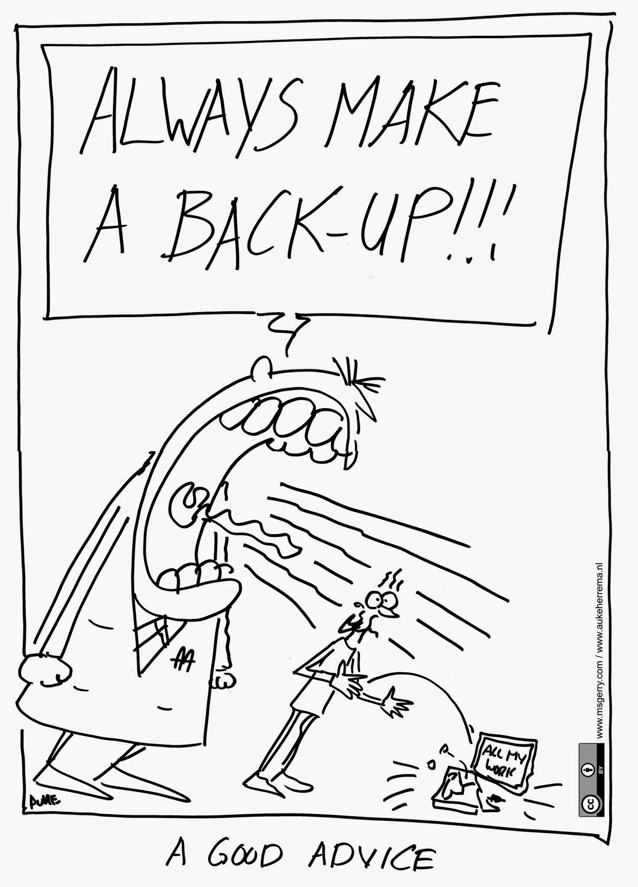

::::::::::::::::::::::::::::::::::::::: objectives

- Describe research data management (RDM)
- Explain FAIR principles and practices for RDM
- Introduce data storage and organisation plan
- Discuss documentation and metadata practices
- Overview of best practices for spreadsheet design

::::::::::::::::::::::::::::::::::::::::::::::::::

:::::::::::::::::::::::::::::::::::::::: questions

- What is considered research data?
- How to start building a research data management plan?
- What is FAIR principles for data management?
- Why care about documentation and metadata standards?
  
::::::::::::::::::::::::::::::::::::::::::::::::::

## Research Data Management

Research data management is a huge topic here, because only well managed data can be well analysed and can be usefully shared with the community. It raises concerns and challenges, but also opportunities.
It represents about 5% of the time in a research project. Some estimate that it can save up (on average) about 15% of the research time (less time lost due to data loss, fewer errors in the data, automated analysis, data and analysis code reuse). 

:::::::::::::::::::::::::::::::::::::::::  callout

## Invest in data management because:

- Managing your data allows you to always find your data and ensure the quality of scientific practice or research.
- Storing your data properly and backing up regularly prevents data loss.
- It can help with recognition for all research outputs.
- It stimulates collaboration with others, who will find it easier to understand and reuse your data.
- RDM is cost/time efficient, as you will always be able to find and use your data.

:::::::::::::::::::::::::::::::::::::::::

:::::::::::::::::::::::::::::::::::::  testimonial

### Need to consider standard file formats for future use of data!

*Electron Microscope Facility in our institute has produced around 5 petabytes (5,000,000 GB) of data since the institute opening.
These files are stored safely and privately, and have not been standardised.
As a result they are in danger of being lost forever, stored but never used.
With metadata, this could form a transformative training data set for machine learning tools and possibly lead to new discoveries and insights.
Creating Alpha Fold and other machine learning/AI tools you need large data sets.
Meta data allows data to be future proofed for further research and even innovative research not currently possible.*

::::::::::::::::::::::::::::::::::::::::::::::::::

## Overview of Research Data Management

Research Data Management (RDM) covers how research data can be stored, described and reused. Data here is used as a generic term to encompass all digital objects. RDM is a vital part of enabling reproducible research.
RDM ensures efficiency in research workflows, and also greater reach and impact, as data become FAIR (Findable, Accessible, Interoperable and Reusable).

Data should be stored in multiple locations and backed up regularly to prevent loss or data corruption. It is also important to consider the whole life cycle of the data (especially making collected data computer readable) when designing data management plan and tasks.

Clearly describing data using documentation and metadata ensures that others know how to access, use and reuse your data, and also enable conditions for sharing and publishing data to be outlined.

 

### The Research Data Lifecycle - A Model for Data Management

Research data often follows a ‘lifecycle' that follows the research project as it evolves.
This model provides a sound basis on which to plan for research data management, from data creation at the start of a research project, through to publishing and sharing research at the end of the project, and archiving any research data for the long-term and future re-use once the project has ended.

The research data lifecycle involves data creation, data use, data publication and sharing, data archiving, and data re-use or destruction.
However, data have a longer lifespan than the research project that creates them. In a Data Management Plan, you can structure how you will manage and share your research data.

## Data Management Plan

A Data Management Plan (DMP), or Output Management Plan, is a document that describes how your research outputs will be generated, stored, used and shared within your project.
A DMP is a living document, which can be updated throughout the research project as needed.

A Data Management Plan is a roadmap for you to manage your data efficiently and securely. This can prevent data loss or breaches.
Planning ahead on how to manage your data consistently can save you time later on!

### A Data Management Plan should provide information on five main topics

1. **Roles and Responsibilities** for the management of the data and code to help prevent confusion/miscommunication later in the project.
  Please check the DMP recommendations and requirements library research support team of your institute and the website of your funder.
  You can check if your funder or institute has a DMP template using [DMPonline](https://dmponline.dcc.ac.uk/).
2. **A list of types, standards and formats** for data, documentation and metadata (discussed later) should allow team members to understand to comply with the recommendations from the start of the project.

- A distinction can be described in the plan separately for different data types such as raw (primary), processed and ready to use (finalised to publish) datasets.
- All types of data will have to be described to be placed into context by using metadata and adequate documentation which will allow anyone in your team to interpret the data in the future.

3. **Data storage and backup procedures** should be assessed for each project and established depending on the institutional requirements, associated costs and recommended format from your field. We will diuscuss this in detail later in this lesson.
4. **Preservation of the research outputs** can be managed differently based on if they can be made publicly available or not. Personal data or research outputs needed to apply for patents cannot be publicly shared but they still have to be preserved for several years, depending on the policies of your country, institute and funder. Learn more about this in detail in [Sharing and Archiving Data](https://the-turing-way.netlify.app/reproducible-research/rdm/rdm-sharing.html#rr-rdm-sharing) chapter in *The Turing Way*.
5. **Reuse of your research outputs** should be ensured by selecting licenses for different components of your research when you make your output available on a repository (see the Licensing subchapters on [data](https://the-turing-way.netlify.app/reproducible-research/licensing/licensing-data.html#rr-licensing-data) and [software](https://the-turing-way.netlify.app/reproducible-research/licensing/licensing-software.html#rr-licensing-software) for more information). A dedicated document (such as a README file) is recommended for describing research outputs into context. UK Data Service has provided a [Data Management Checklist](https://ukdataservice.ac.uk/learning-hub/research-data-management/plan-to-share/checklist/) to help cover different aspects of the DMP.

:::::: callout
## Plan for reproducible research

When planning a reproducible analysis, your data management plan will change. Because you want to avoid any manual wrangling of the data (copy-paste, analysis in excel, ...), you need to take particular care of the format of the raw data, making it if possible computer readable with the programming language you will be using. Keep the raw data as raw as possible so that errors can be avoided and calculations can be changed. Also when a software provide you with both raw data and pre-analysed data, you should consider early which file you will be using in your analysis (in most cases, using the raw data will make your analysis more robust and easier to reuse for other researchers). 
Also information may be lost when transforming the raw data, so make new versions and keep the original file safe.

:::::: 

### Who writes a Data Management Plan ?

At best, the whole team should participate in the planning.
It is often good to have some specialist who knows what are the backup and publication pathways at the institution or in the research domain.
Only the data collectors will know details about the data, though.
The data analysts need to be involved to make sure the data is relatively easy to analyse
In addition, the researchers will have to implement the plan, so they need to be aware and to agree with it.

:::::: callout

When the data is meant to be open, researchers with different questions and needs may try to analyse the data in unexpected ways. These researchers will not be there at the Data management plan stage and the researchers will probably not have included their needs.

A way to make the data the most useful is to take the FAIR principles into account, keep the raw data raw, and add metadata. A critical metadata component in this case is a contact person, who may be able to explain the data and its analysis to new researchers.
::::::

## Defining Data

Data are objects that you use and produce during your research life cycle, encompassing data
sets, software, code, workflow, models, figures, tables, images and videos, interviews, articles. Data are your research asset.
A good way of thinking about what might be classed as data that needs to be managed is to ask yourself the questions:

- What is the information that I need to use and write about in my paper or book?
- What information would I need to back up my conclusions?
- What information is needed by others to understand and possibly replicate the research that I have done?
  This information is your data.

:::::::::: discussion

- What data are you collecting ?
- Is it all digitalised?
- Do you work with an open format, which will be readable in 10 years ?

::::::::::

:::::::::: challenge

When collecting the Body-mass index (BMI) of participants, how would you do this ?

::::::: solution

Best to record the height and weight of the subject. These are more raw forms of the data. 

- This is the information the recording devices will give so errors are avoided. 
- the BMI may not be the best measure in the future, weight + height is more informative than the BMI.
:::::::

::::::::::
  
  
## Using spreadsheets

Here we made a special section on spreadsheets design and management, because  **most data analysis nightmares (and time waste) are due to bad spreadsheet design. **

More information is available in the [extra content of this course](learners/spreadsheets.md). Please refer to the [Data Carpentry Ecology Lesson](https://datacarpentry.org/spreadsheet-ecology-lesson/) and *The Turing Way* chapter for [managing data in spreadsheet](https://the-turing-way.netlify.app/reproducible-research/rdm/rdm-spreadsheets.html) for best practices.

Spreadsheets, such as Microsoft Excel files, google sheets, and their Open Source alternative [(for instance) LibreOffice](https://www.libreoffice.org), are commonly used by wet-lab experimentalists to collect, store, manipulate, analyse, and share research data.
Spreadsheets are convenient and easy-to-use tools for organising information into an easy to write and easy to read forms for humans.
However, one should use them with caution, as the use of an inappropriate spreadsheet is a major cause of mistakes in the data analysis workflow.

As a project manager, it is important to see that spreadsheet are only used to collect information, but that manipulation and analysis are made in a programming environment. This also means that the information should be understandable by humans, and readable by machines.

This includes:

- Only one table per spreadsheets
- Spreadsheet are stored as .csv or .tsv files (no color, no merging cells)
- Spreadsheet can be read by the programming language in use (they are tidy)
- At best, there is an automatic validation tool is run on the spreadsheet.
- New data should lead to new rows (and not new columns).

{alt='An illustration of tidy data with three panels with three titles. Arrows are indicating the direction: vertical arrows for variables, as they should be indicated in columns, and horizontal arrows for observations , as they should be indicated in rows. In the third pannel, a circle is present on each cell to represent that there is one unique value per cell.'}

## File names and folder structure

While some structure may be given during the project setup, one should keep track of the sub-structure added, make sure the files are saved in the correct folder. In addition, one should make sure that file names are chosen carefully. Indeed, the file name is the first encounter with a file and making names informative can save a lot of time especially when searching for a specific file. File names should be both human and computer readable (conveying information about the file content, in a way a computer can extract it.)

It is important to have written conventions that are easy to find. [turingway chapter](https://the-turing-way.netlify.app/reproducible-research/rdm/rdm-storage.html?highlight=name#file-naming-conventions)

::::challenge
What date is this date : 01.03.1931
 
January 3st 1931 ? (USA)
March 1st 1931 ? (the rest of the world)

How to write the date in an excel spreadsheet ? 

::::::::::::::: solution
 
While the standard is 1931-03-01 (YYYY-MM-DD), excel will transform this into a number, the only safe way to deal with dates in Excel is to have 3 columns.

:::::::::::::::

::::

::::::::::::::: callout

Naming files tips:

- names should be unique in a project
- file location should not be needed to understand what the file is about
- as short as possible, as long as necessary
- avoid abbreviation if possible, document them well otherwise.
- when using dates, use ISO format: yyyy-mm-dd (yyyymmdd can work too)
- no special characters (no space) in filenames, use - or _
- use only lowercase or be very careful (linux versus other systems)

see https://speakerdeck.com/jennybc/how-to-name-files

:::::::::::::::

## Documentation and Metadata

Having data available is of no use if it cannot be understood. Therefore research data should always include consistent documents and metadata.

Data documentation provides contexts and full description about the data.
It allows your collaborators, colleagues and future you to understand what has been done and why.
Ideally written in clear and plain language, documentation describes data with sufficient information such as source, strengths, weaknesses, and analytical limitations of the data allowing users to make informed decisions when using it.

Without metadata to provide provenance and context, the data can't be used effectively.
Metadata is information about the data, descriptors that facilitate cataloguing data and data discovery.
Often, metadata are intended for machine reading.
When data is submitted to a trusted data repository, the machine-readable metadata is generated by the repository.
If the data is not in a repository a text file with machine-readable metadata can be added as part of the documentation.

- The type of research and the nature of the data also influence what kind of documentation is necessary. It is best practice to use recognised community metadata standards to make it easier for datasets to be combined.
- The level of documentation and metadata will vary according to the project type and the range of stakeholders, including the future users.
- Examples of documentation may include items like [data dictionaries](https://help.osf.io/hc/en-us/articles/360019739054-How-to-Make-a-Data-Dictionary) or codebooks, protocols, logbooks or lab journals, README files, research logs, analysis syntax, algorithms and code comments.
- Variables should be defined and explained using data dictionaries or codebooks.
- Data should be stored in logical and hierarchical folder structures, with a README file used to describe the structure.

:::::::::::::::::::::::::::::::::::::  testimonial

### REMBI: Example of metadata in bioimaging data

REMBI: **Recommended Metadata for Biological Images—enabling reuse of microscopy data in biology**, Sarkans, U., Chiu, W., Collinson, L., Darrow, M. C., Ellenberg, J., Grunwald, D., ...Brazma, A. (2021). Nature Methods, 18(12), 1418–1422. doi: [10\.1038/s41592-021-01166-8](https://www.nature.com/articles/s41592-021-01166-8)

Bioimaging data have significant potential for reuse, but unlocking this potential requires systematic archiving of data and metadata in public databases.
Cryo-EM and cryo-ET have proven to be powerful tools for determining high-resolution structures of biological matter and examining the functional cellular context of macromolecular complexes.

REMBI is a draft metadata guidelines to begin addressing the needs of diverse communities within light and electron microscopy.
The current version of REMBI, including examples from the fields covered by the three working groups is shared online via [http://bit.ly/rembi\_v1](https://docs.google.com/spreadsheets/d/1Ck1NeLp-ZN4eMGdNYo2nV6KLEdSfN6oQBKnnWU6Npeo/edit#gid=1023506919).

::::::::::::::::::::::::::::::::::::::::::::::::::

## Data Storage, Organisation and Backup Procedures

{alt='Illustration of backup need with the legend "a good advice". One big character is crying "always make a backup" loud. A second character is startled and let their computer labelled "all my work" fall on the floor and crash.'}

Data loss can be catastrophic for your research project and can happen often. You can prevent data loss by picking suitable storage solutions and backing your data up frequently.

- Most institutions will provide a network drive that you can use to store data.
- Portable storage media such as memory sticks (USB sticks) are more risky and vulnerable to loss and damage.
- Cloud storage provides a convenient way to store, backup and retrieve data. You should check terms of use before using them for your research data.

Especially if you are handling personal or sensitive data, you need to ensure the cloud option is compliant with any data protection rules the data is bound by.
To add an extra layer of security, you should encrypt devices and files where needed.
Your institution might provide local storage solutions and policies or guidelines restricting what you can use.
Thus, we recommend you familiarise yourself with your local policies and recommendations.

:::::::::::::::::::::::::::::::::::::::::  callout

## Note

- Some concepts discussed in the previous chapter such as setting up project repository, version controlling, pre-registration, and licensing apply to this point.
- Also consider FAIR practices, data organisation and handling sensitive data practices, as well as metadata and documentation that are discussed below.
  

::::::::::::::::::::::::::::::::::::::::::::::::::

### Backups

To avoid losing your data, you should follow good backup practices.

- You should have 2 or 3 copies of your files, stored on
- at least 2 different storage media,
- in different locations.

The more important the data and the more often the datasets change, the more frequently you should back them up.
If your files take up a large amount of space and backing up all of them proves to be challenging or expensive, you may want to create a set of criteria for when you back up the data. This can be part of your data management plan (DMP).

When you are ready to release the data to the wider community, you can also search for the appropriate databases and repositories in [FAIRsharing](https://fairsharing.org/databases), according to your data type, and type of access to the data.
Learn more about this in *The Turing Way* chapter on [sharing and archiving Data](https://the-turing-way.netlify.app/reproducible-research/rdm/rdm-sharing.html#rr-rdm-sharing).

<!--
[Add recommendations from 1:1 interviews, open communities such as Open Life Science and The Turing Way.]-->

## The FAIR Principles

The FAIR guiding principles for scientific data management and stewardship are guidelines to improve the **F**indability, **A**ccessibility, **I**nteroperability and **R**eusability of digital assets; all of which support research reproducibility.
The FAIR principles facilitate the availability of research data so that others can reuse data.

:::::::::::::::::::::::::::::::::::::::::  callout

## FAIR data should be:

- **Findable**: The first step in (re)using data is to find them! Descriptive metadata (information about the data such as keywords) are essential.
- **Accessible**: Once the user finds the data and software they need to know how to access it. Data could be openly available but it is also possible that authentication and authorisation procedures are necessary.
- **Interoperable**: Data needs to be integrated with other data and interoperate with applications or workflows.
- **Reusable**: Data should be well-described so that they can be used, combined, and extended in different settings.
  
{alt='Four FAIR principles depicted.'}
::::::::::::::::::::::::::::::::::::::::::::::::::

Making data ‘FAIR' is not the same as making it ‘open'. Accessible means that there is a procedure in place to access the data. Data should be as open as possible, and as closed as necessary. It is also important to say that the FAIR principles are aspirational: they do not strictly define how to achieve a state of FAIRness, but rather describe a continuum of features, attributes, and behaviours that will move a digital resource closer to that goal. Even though the FAIR principles have been defined to allow machines to find and use digital objects automatically, they improve the reusability of data by humans as well. The capacity of computational systems to find, access, interoperate, and reuse data, with minimal human intervention, is essential in today's data-driven era.

You can find a more detailed [overview of the FAIR principles by GO FAIR](https://www.go-fair.org/fair-principles) of what the FAIR principles recommend.

### Summary of "FAIR - How To"

> We have provided an additional lesson to discuss the How-Tos of FAIR principles in the context of data and software. See [FAIR How-To for data and software](learners/04-FAIRHowTo.md) for detail.
> 
> - Reference: E. L.-Gebali, S. (2022). BOSSConf\_2022\_Research\_Data\_Management. Zenodo. doi: [10\.5281/zenodo.6490583](https://doi.org/10.5281/zenodo.6490583)

- Deposit your data where others can find it, keep in mind where your peers can find it, such as, field specific repository and give it a stable unique identifier (PID).
- Make your data \& metadata accessible via standard means such as http/API.
- Create metadata and explain in detail what this data is about, never assume people know!
- Deposit metadata with PID and make it available with/out data i.e. in case data itself is heavily protected.
- Include information on ownership, provenance and citation.
- Outline what the reusers of your data are/not allowed to do, use clear license. Commonly used licenses like MIT or Creative Commons (keep in mind funders requirements).
- Specify access conditions, if authentication or authorization is required.
- Describe your data in a standardized fashion using agreed terminology and vocabulary.
- Share the data in preferred \& open file formats.
- Start the process early on!

## A Note on Personal or Sensitive Data

Personal data is information about **living people** who can be identified using the data that you are processing, either directly or indirectly.
A person's name, address or Social Security number, as well as, racial/ethnic identity, political opinions, religious/philosophical beliefs, trade union membership, genetic and biometric data, physical or mental health, and sexual orientation are some examples of personal data.
Indirect identifiers include health, economic, cultural or social characteristics.
Especially when a certain combination of these identifiers can be used to identify a person, care must be taken to manage the data properly.

There are various policies in place in different countries to protect the rights of individuals over their personal data.
For instance, in the European Union and the UK the **GDPR** (General Data Protection Regulation) applies to the processing of personal data and may require researchers to carry out a Data Protection Impact Assessment ([DPIA](https://youtu.be/YRiCb3unz3g?t=988)).
Processing means doing anything with a person's information, including collection, storage, analysis, sharing, deletion and destruction.
Please review the national/institutional policies that apply to your research to ensure that you are up to date with the requirements of managing sensitive data.
Please read [Personal data management](https://the-turing-way.netlify.app/reproducible-research/rdm/rdm-personal.html), [informed consent](https://the-turing-way.netlify.app/reproducible-research/rdm/rdm-personal.html#informed-consent), [Research Ethics Committees Processes](https://the-turing-way.netlify.app/ethical-research/ethics-committees.html) and [Open Data](https://the-turing-way.netlify.app/reproducible-research/open/open-data.html) sections in *The Turing Way* for further details.

## Acknowledgement

- This episode is a reuse of *The Turing Way* chapter on [Research Data Management](https://the-turing-way.netlify.app/reproducible-research/rdm.html).
- Among many authors, reviewers and contributors, we thanks Esther Plomp (Data Steward at TU Delft) for maintaining this chapter in The Turing Way Guide for Research Data Management.
- Please cite *The Turing Way* as: The Turing Way Community. (2021). The Turing Way: A handbook for reproducible, ethical and collaborative research (1.0.1). Zenodo. [https://doi.org/10.5281/zenodo.5671094](https://doi.org/10.5281/zenodo.5671094)

:::::::::::::::::::::::::::::::::::::::: keypoints

- Data management plan is produced by the whole team. 
- All information is present and digitalised
- Raw data is raw
- Spreadsheets are tidy, validated and in text format (.tsv)
- Data is safe (backup)
- Data is FAIR (findable, accessible, interoperable and reusable)
- Data can be opened and analysed in a programming language

::::::::::::::::::::::::::::::::::::::::::::::::::

