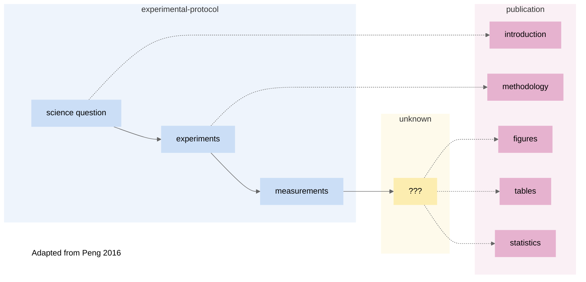
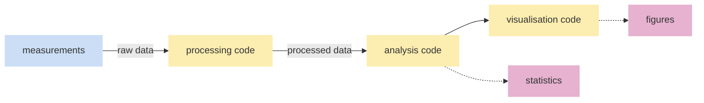
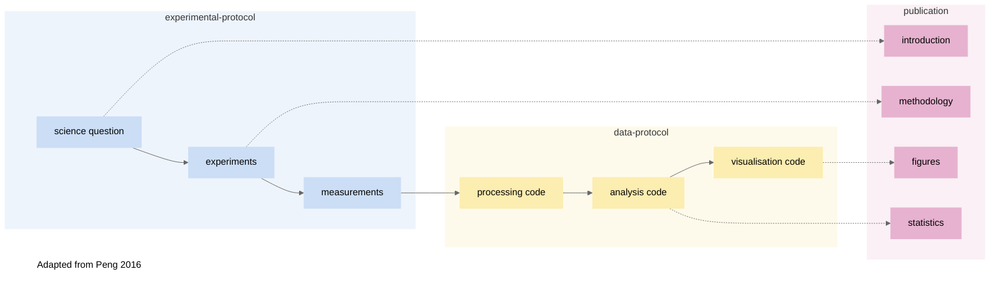

## Starting with Scientific Process

In reproducible scientific research, someone should be able to look at your work and understand in detail what was done and why. 

Published papers ideally share the background and logic of the hypotheses in the Introduction section of a publication while experimental protocols are shared in the methodology section. However, the steps involved with data processing/analyses are too often opaque:

> *When reading a published paper, not all the steps involved are clear.*

Within the traditional scientific pipeline to publication, the missing steps can be thought of as **Data Protocol**.

> *Data protocol*

Each of the steps for data protocol should be reproducible and open. 

**Processing code**

The computational steps that take raw data to a clean output, whether through filtering, subsetting, or other transformation. 

**Analysis code** 

Computational methods that can be as simple as statistical tests, models, or neural networks and machine learning. 

**Visualisation code**

Making figures for publications (for example with R). 

And so the map for scientific process is now complete:

Moreover, we can go beyond research articles and publications with publishing data and code repositories. This provides more opportunity to increase the impact of scientific research. Funding bodies and journals often make accessible data compulsory, and it is becoming more common to release code as well. 

[^murphy]:  A Quick Guide to Organizing Computational Biology Projects
Noble WS (2009) A Quick Guide to Organizing Computational Biology Projects. PLOS Computational Biology 5(7): e1000424. https://doi.org/10.1371/journal.pcbi.1000424

## Understanding this process in computational projects

- What challenges and issues exist
- Identify components for project management 
- Approach: We will use the workflow shown in the image to guide interactive session to find different components in each stage of research (design stage - experiment - data analysis - publication), this will be revisited in the beginning of each chapter to show where we are in that workflow/process when talking about a new concept/practice

Intention to Release

A modular and documented workflow requires energy and intent from the start. In lab work, it is easy to skip writing in a lab book to save minutes, but further down the line weeks or months are lost unpicking or redoing the work. 

Those wishing to reproduce your work would have the means to do so. Guiding principles aside, there are also selfish reasons for reproducible workflows and records of critical decision points.

> "Anything that can go wrong will go wrong."
>
> Murphy's First Law

And so, whether due to mistakes or extending projects, *"anything you do you will probably have to be done again"*. [^murphy] Despite few life scientists having formal training in computer science, the majority of research now requires computational methods, whether creating a figure, testing a model, or training a neural network. As a group leader, there is a responsibility to ensure your team creates modular and reproducible workflows whether they are working in a lab or in RStudio. 

Some lab workflows are shared globally and become universal.


