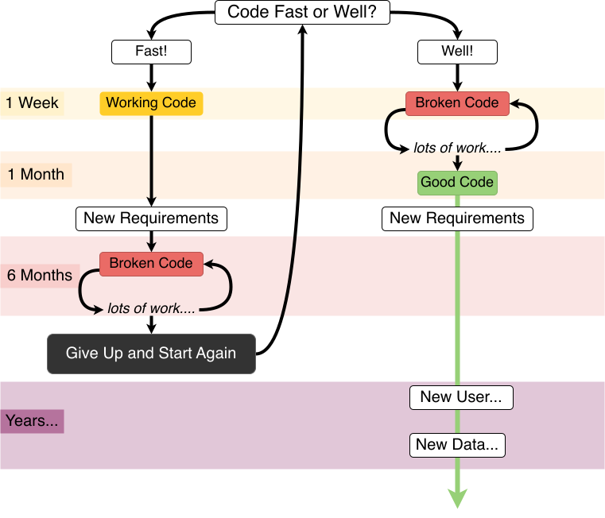

## Project Management Tools

Researchers who already use Github/GitLab to store and version control their projects can use several online features for project management.

**Issue** is a GitHub integrated feature that allows everyone to track the project's progress on GitHub.
Similar to a 'To-Do List', issues can be anything from a project milestone (releasing an R package, submitting to an online data repository, a working simulation) but also specific issues with code (fixing a bug, adding a function, updating tests). 

Based on the tasks described in an issue, your collaborators can address them and save or 'commit' changes in their local copy of the repository.
Local changes then can be 'pushed' to the repository on GitHub for 'review' via the **Pull Request** feature.
Once a pull request is opened, different collaborators can discuss and review the potential changes and add follow-up commits before those changes are 'merged' into the main repository.

**Project boards** are kanban like features on GitHub that help you visualise (list of tasks), categorise (in columns) and prioritise (drag/move around) different tasks. 
A collection of project boards can be created for a different set of tasks, comprehensive roadmaps, or even release checklists. 
By linking **issues and Pull Requests**, project boards can create workflows.
The Project board shows metadata for issues and pull requests, like labels, assignees, the status, and who opened it.
Additional notes within columns can be added as task reminders, references to issues and pull requests from any repository on GitHub.com, or to add information related to the project board. 
This Kanban board feature can be very helpful in getting a snapshot of multiple research projects within a team/lab and tracking what multiple people are currently working on.
You can read more about [Project Board in GitHub Documentation](https://docs.github.com/en/issues/organizing-your-work-with-project-boards/managing-project-boards/about-project-boards).

> *An example Kanban for researcher project management. Boards can be given any name.*

## Collaborative Research Practices

- Functional programming (approach for reproducibility)
- Reproducible environment
- Literate programming: Jupyter Notebook
- Binderise your repo

# Good Code 

Writing code often comes down to decisions about when to save time. 
Code fast, and you have a solution within hours or days. 
Coding well requires an early investment that might be ignored in favour of "I'll just find a quick solution..." But more often than not the time penalty is magnified as a result further down the line:

> *Adapted from the more pessimistic comic by [XKCD](https://xkcd.com/844/)*

Writing good code early means losing days to deliberate good practice. 
But trying to undo mistakes and work with "good enough" code can take weeks or months, and still end up having to start again anyway. 
The blow to morale can also not be understated. 
"Good enough" fast code tends to have mistakes and is hard for others to review, which is not good for scientific pipelines. 
Even if you end up with workable code, it is not suitable for release or publication at the end of the project. 

As a supervisor you can influence by sharing or demonstrating:

- the horrible feeling of finding bugs, but the interesting process of debugging (reading error messages, tracking the bug, fixing it!)
- examples of doing maths and statistics fast, and explaining their importance in data

These are where these time investments happen and help your students avoid the soul-destroying process of working with "spaghetti" code and having to start from scratch. 
Good code is not about perfection, it is about general principles your students and postdocs can get training in.

## Modular Programming (Functions)

- do a diagram of directories
- no copying and pasting
- mindset stable and not changed immutably

> ***Case Study***
>
> *My postdoc wants to work with messy genomics data. I know my previous postdoc had to do the same thing and it took her months.... but it's difficult to read her files so my new postdoc will have to work it out again.*
>
{: .callout}

Applying methods from one person's work and applying it to another problem can take weeks, if not months, of work. 
Applying methods from publications is even harder: static PDF files can’t describe the lines of code and data that lead to those discoveries. 
This is an increasingly important problem in the face of growing mistrust in science, and a reproducibility crisis plaguing the sciences.

Instead, functional programming is about writing code that works as modular steps. 
Each step is clearly commented on and carefully produced so that it can be reused in different contexts. 
Often when you are analysing data, you need to repeat the same task many times. 
For example, you might have several files that all need loading and clean in the same way, or you might need to perform the same analysis for multiple species or parameters. 
Rather than copying and pasting, writing a function and calling that function leads to fewer errors and confusion overall. 

We can think of this on a broad scale, say one student's computational work has the following steps, where blue shows data cleaning, and yellow the analysis and statistics. 

Another student can take reuse the data cleaning and initial visualisation steps because her data was from the same source and is in the same format. She can later add her own model:

On the micro-scale, functional programming ensures that each code file itself is comprised of modular blocks, whether for data processing, analysis pipeline, simulation and so on. 
Depending on your programming language, these may be used as a package or a library or saved in files that are available for installation. 
Just the same as the diagram above, making sure functions are robust and reuseable means they can be shared throughout different workflows and for different projects. 

> Training in functional programming is usually an excellent pre-requisite for members of your lab. 

A first step can be to **draw out** and create diagrams to plan code before starting and identifying the modular steps involved. 
This does not require technical knowledge of a language and is, therefore, a great exercise for direct supervision. 

To find out more...

https://www.britishecologicalsociety.org/wp-content/uploads/2017/12/guide-to-reproducible-code.pdf

## Literate Programming

Literate programming is about comments and documentation and telling other humans what is happening in your pipeline. 
Depending on the scale of your computational projects this will include:

- Inline comments 
- A Readme file
- An RMarkdown or Jupyter Notebook with examples
- An online documentation wiki 

Markdown is a way of writing plain text that doesn't need specific software to read it (so not Microsoft Word), which can be converted to many formats including HTML, PDF or even Word documents. 
Many online tools like popular messaging services use markdown, and marking up your text is not difficult, for example:

`**bold**`
`_italics_`
`# Title`
`## Heading`
`### Subheading`

## Code Review

A simple objective of the review process is to catch bugs and elementary errors. Code review can also help to ensure that code is readable and easy to understand. 
As a group leader, you can also make sure code is functional and literate as early as possible, and encourage your students to avoid messy "good enough" code that causes chaos later. 

Code review is often done in pairs, with each reviewer also having some of their code reviewed by their partner. 
Doing this can help programmers to see and discuss issues and alternative approaches to tasks, and to learn new tips and tricks.

There are different methods for code review. 

### Synchronous/Looking Over The Shoulder

**Helping the student go through their scripts, catch errors and debug side by side **

> The PI sits down with her PhD student who has been writing a function for cleaning bioinformatics data. 
> The PI knows Python well and takes the opportunity to teach the student how to organise the code better. 
> The student shows the PI some odd errors and so they run some tests with expected outcomes to find what the problem is and solve it. 
> The PhD student learns how unit tests can help make code robust. 

The problem with synchronous coding sessions is making time for it and whether or not the supervisor has experience with the specific language.  

### Synchronous/Group Code Tour

**Narrating code and software steps**

The researcher may present their pipeline to describe the logical steps using documentation, pseudocode, or describing how to run the code.

> A postdoc has been working on some analysis that provides statistics results that he hopes to publish soon. During a lab meeting, the postdoc presents the steps of the analysis code as logical steps. 
> The lines of code are shown for those in the meeting that know R, but the postdoc explains the steps verbally as well for those who don't understand R. 
> The group discuss and provides comments on the choices and order of the analysis pipeline, a PhD student notices a jump in logic that wasn't picked up previously, and an advanced R user in the lab makes suggestions about making some parts run faster.

- more detail about the flat hierarchy, not scalable to have the expert to the review
- doesn't need to be an expert

These sessions do not rely on everyone knowing the language, and it is the responsibility of the coder to present their work clearly and logically for everyone to follow. 
Group discussions can be very informative for everyone involved and put the analysis under scrutiny. 
However, making sure everyone is free at the same time for a lab meeting can be challenging. 

### Asynchronous/I'll get back to you on that

The supervisor or collaborator runs the code themselves using a reproducible environment, or simply reads through the scripts. 
Github has features to help with this (see extra file for a tutorial in GitHub reviews)

> A postdoc has created a model in Python and creates a Binder with all the dependencies necessary. 
> She sends the file to her supervisor who can run the code within her browser, no installation is required. 
> The supervisor can then run the code herself to review it and check the individual parts over the next week. 
> The supervisor adds a commented version of the script to the postdoc's repo with a merge request. 

Reviewing code in small chunks incrementally as the project is developing can help make the code review process a lot more efficient. 
Asynchronous feedback removes the time pressure but can be easily forgotten!

> *Don’t review more than 400 lines of code at a time, less than 200 lines are better. Don’t review more than 500 lines an hour.*

Multiple people can also review the code asynchronously. 

> [Turing Way: Recommendations for Code Reviewing](https://the-turing-way.netlify.app/reproducible-research/reviewing/reviewing-recommend.html)
>
> Unlike traditional, “academic-style” peer review, most code review systems have several advantages: they’re rarely anonymous, they’re public-facing, and without the middleman of an editor, contact between reviewer and reviewee can be direct and rapid. 
> This means code review is typically a fast, flexible, and interactive process.

### *Reviewing is not about creating more work, nor the PI rewriting everything.*

Instead, it is just another part of peer review and accountability within the scientific process. 
It is also an opportunity for everyone to learn better practices from each other, and solve issues that have plagued one person for weeks!

>
> *Scientists are very aware that their understanding of code dissipates over time and that this is a large hidden cost. Equally, they suspect that they spend a lot of time reinventing wheels. 
> They may not know how code review will help with that, but they hope that it will.* 
>
> ...
>
> *One of the mentors expected scientists to overhaul complete code bases. The advice from one mentor was cogent: if you check the docstring and write a test every time you touch a method, the code improvements will accumulate over time with minimal effort.*
>
> *Someone who isn’t intimately involved with your project should understand from the module documentation and the comments what you are trying to do, what approach you’re taking, and why they should expect it to work.*
>
> ...
>
> *Take some time to prepare a presentation about your code that will answer the above questions even for someone who hasn’t read the code. You’re more likely to get useful feedback, rather than nitpicking about syntax, if the audience can see the big picture.*
>
> ...
>
> *Keep it a safe environment, i.e. make sure chastising is relatively gentle even when deserved (but do point out when code doesn’t meet the required standard – frame it as a learning experience though).*
>
>***Petre, Marian, and Greg Wilson. "Code review for and by scientists: preliminary findings." (2014).***

Further considerations in code review can be found here:

[Turing Way: Code Reviewing Process](https://the-turing-way.netlify.app/reproducible-research/reviewing.html)

[Code Reviews: the Lab Meeting for Code, F. Perez](http://fperez.org/py4science/code_reviews.html)

### What to look for during Code Review

<imzg src="https://the-turing-way.netlify.app/_images/readable-code.jpg" alt="drawing" width="400"/>

Reviewing code makes a big difference. Knowledge of the language is not always necessary!

These are very common, everyone does this.

**Bugs/Potential bugs**
- Repetitive code
- Code saying one thing, documentation saying another
- Off-by-one errors
- Making sure each function does one thing only
- Lack of tests and sanity checks for what different parts are doing
- Magic numbers (a number hardcoded in the script)

**Unclear, messy code**
- Bad variable/method names
- Inconsistent indentation
- The order of the different steps
- Too much on one line
- Lack of comments and signposting

**Fragile and non-reusable code**
- Tailor-made and manual steps
- Only works with the given data

*Modified from [*What to look for when code reviewing*](https://www.cs.swarthmore.edu/~alinen/cs71/labs/lab03.html)*

### Benefits of Code Review

The main benefit is finding problems, and finding them early enough that there aren't frustrating consequences. 
The penalty for finding a bug once all the figures have been produced and conclusions drawn, or, worst-case scenario, after a publication, is much higher than the penalty for taking the time to review.

> *In a group of 11 programs developed by the same group of people, the first 5 were developed without reviews. 
> The remaining 6 were developed with reviews. After all the programs were released to production, the first 5 had an average of 4.5 errors per 100 lines of code. 
> The 6 that had been inspected had an average of only 0.82 errors per 100. Reviews cut the errors by over 80 percent.*
> 

Writing code collaboratively also benefit directly your team members:

- Less time redoing work or refactoring
- Increased productivity
- Greater confidence in own work
- Learning better techniques
- Reduced time debugging alone
- Knowledge exchange and group cohesion

For a group leader, the benefits include:

- Better understanding of the projects
- More maintainable and better-documented code that is easy to understand and modify
- Better insight into any problems with data
- Earlier visibility of quality issues
- Group reviews reduce the work burden
- More robust analysis pipelines that can be reused and modified 
- High-quality code that can be released

**Important things to bear in mind:**

Code reviews should not be used to evaluate individuals and their skill levels. An open and safe environment where revealing mistakes and errors should not come with penalties or shame. Code reviews should also be done early and often, to protect "egos":

> *The temptation to perfect the product before you allow another pair of eyes to see it. 
> This is an ego-protecting strategy: you won’t feel embarrassed about your mistakes if no one else sees them. 
> ...review [is not] a seal of approval but rather in-process quality-improvement activity. 
> Such reluctance has several unfortunate consequences.*
>
> *If your work isn’t reviewed until you think it’s complete, you are psychologically resistant to suggestions for
changes. 
If the program runs, how bad can it be? You are likely to rationalize away possible bugs because you believe you’ve finished and you’re eager to move on to the next task. Relying on your own desk checking and unit testing ignores the greater efficiency of a peer review for finding many defects*
>
> **Peer Reviews in Software: A Practical Guide by Karl E. Wiegers**

## Group Code Writing

As well as reviewing specific scripts and analyses written by a single individual, can be very beneficial to solving programming problems as a team. 
Setting aside an afternoon to work as a group will help teach less experienced members of the group and more efficiently solve very difficult problems. 

Groups of people working on a specific problem are often known as "Hackathons" in programming. 
These can last multiple days (hopefully with downtime!). With very large groups, people can work in pairs or small groups with delegated parts of the problem to solve and regularly meet back together to discuss and evaluate. 
If there is a complex solution in computational methods that most people in the group need, it makes sense to find it together. 

Similarly, documentation sprints are useful to dedicate time to regularly bring a codebase to a good minimum standard. 
Splitting the task across the team as an event, creating documentation and working examples for code repos and releasing it can help others use your computational methods and tools to increase the impact of your work. 
Having regularly updated documentation also reduces onboarding time for new members picking up the shared methods in the lab. 

Group work shares the burden and allows knowledge exchange and support within the team. 

## Testing

- Testing and quality checks
- Continuous integration

## Conclusion
- What gaps have we filled in this section
- Project management overview 

## Resources for taking this to next level

- https://the-turing-way.netlify.app/collaboration/new-community.html 



