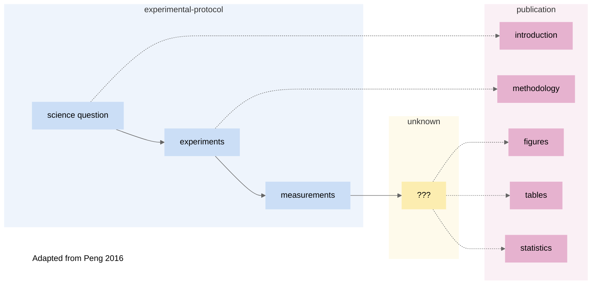
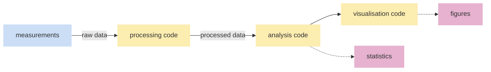
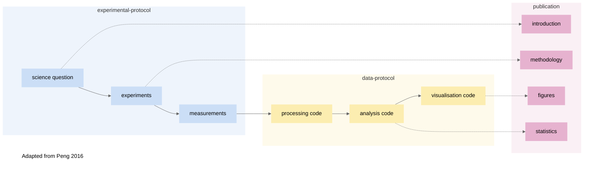

# Training Materials


## `1` Starting with the Scientific Process

In reproducible scientific research, someone should be able to look at your work and understand in detail what was done and why. 

Published papers ideally share the background and logic of the hypotheses in the Introduction section of a publication while experimental protocols are shared in the methodology section. However, the steps involved with data processing/analyses are too often opaque:


> *When reading a published paper, not all the steps involved are clear.*

Within the traditional scientific pipeline to publication, the missing steps can be thought of as **Data Protocol**.


> *Data protocol*

Each of the steps for data protocol should be reproducible and open. 


**Processing code**

The computational steps that take raw data to a clean output, whether through filtering, subsetting, or other transformation. 

**Analysis code** 

Computational methods that can be as simple as statistical tests, models, or neural networks and machine learning. 

**Visualisation code**

Making figures for publications (for example with R). 

And so the map for scientific process is now complete:





Moreover, we can go beyond research articles and publications with publishing data and code repositories. This provides more opportunity to increase the impact of scientific research. Funding bodies and journals often make accessible data compulsory, and it is becoming more common to release code as well. 


[^murphy]:  A Quick Guide to Organizing Computational Biology Projects
Noble WS (2009) A Quick Guide to Organizing Computational Biology Projects. PLOS Computational Biology 5(7): e1000424. https://doi.org/10.1371/journal.pcbi.1000424

### Thinking in Teams


## `2` Setting up a Computational Project

### `2.1` Intention to Release

A modular and documented workflow requires energy and intent from the start. In lab work, it is easy to skip writing in a lab book to save minutes, but further down the line weeks or months are lost unpicking or redoing the work. 

Those wishing to reproduce your work would have the means to do so. Guiding principles aside, there are also selfish reasons for reproducible workflows and records of critical decision points.

> "Anything that can go wrong will go wrong."
>
> Murphy's First Law

And so, whether due to mistakes or extending projects, *"anything you do you will probably have to be done again"*. [^murphy] Despite few life scientists having formal training in computer science, the majority of research now requires computational methods, whether creating a figure, testing a model, or training a neural network. As a group leader, there is a responsibility to ensure your team creates modular and reproducible workflows whether they are working in a lab or in RStudio. 

Some lab workflows are shared globally and become universal.

**Pre-registration**

**License**


### `2.2` Project Board

### `2.3` Version Control & Tools

**Git**

Git Large File Storage for 1GB: https://git-lfs.github.com/
Tutorial by coderefinery https://coderefinery.github.io/git-intro/


**Github**

**Open Tools**


### `2.4` Onboarding Team Members

**Training**

**Access**

## `3` Method Selection

### `3.1` Building on Existing Knowledge

### `3.2` Resource Requirement

**Storage, Hosting and Archiving**

**High Powered Computing**

**Data Safe Havens**

### `3.3` Is AI Suitable?


## `4` Implementation and Management

### `4.1` Literate Programming & Notebooks

**FAIR Principles**

### `4.2` Reproducible Environments

### `4.3` Code Reviews & Sprints

**Managing Code Reviews**

**Managing Group Reviews**

**Code Sprints & Hackathons**

## `5` Data Analysis and Results

### `5.1` Data Wrangling

### `5.2` Tests

### `5.3` Data Exploration & Insights

### `5.4` Communicating Results

## `6` Publication and Release

### `6.1` Code Release

### `6.2` Data Release

### `6.3` Open Tool Contribution

### `6.4` Preprints


---


# Disorganised Notes

Long after the project is “done”, it is possible to:
- Compile/install/run the software (Usability).
- Read and understand the code (Readability).
- Update the program (Maintainability).
- Reuse the code/program (Reusability).

It should be possible to build upon existing research software (Extensibility).

Typical hindrance to reusability and extensibility are hard-coded parameters and file paths and low modularity.

- Bugs are easier to catch and easier to fix.
- Source code is easy to navigate.
- Source code is easy to modify.
- Code can be understood months or years after development.
- Software can be reused across projects, instead of starting from scratch.
- Software can be extended to new situations.
- Open source, quality research software increases credibility and visibility of research.


Hurdles in the way of improving software quality:
- Lack of exposure to good examples.
- Misconception of what “good code” looks like. “This code runs really really fast: it must be great! (Although I can’t understand it.)”
- Too few resources relevant to researchers.
- Lack of training.
- Assumption that the code will never be read.

Simple approach you can apply today:
- Choose descriptive names.
- Avoid nested logic (for/if/else).
- Reduce the size of functions’ parameter lists.
- Break long functions into smaller functions.
- Follow a style guide.
    - R: tidyverse
    - Python: 	PEP8
    - C++: 	LLVM style guide

**Preregistered** -> P-hacking free

**Open data** -> Check our numbers

**Open Materials** -> replicate our results

```
README.md

RawData/ (read only)
- DataSet1.csv
- DataSet2.csv

ProcessedData/ (disposable)

Scripts/
- run_analysis
- create_figure1
- ...

WorkingExample
- example_notebook.ipynb

Figures/
- figure1.svg

Manuscript/
```

Automate the scripts:
```
run_analysis.R:
 source("01_load_packages.R")
 source("02_clean_data.R")
 source("03_explore.R")
 source("04_model.R")
 source("05_summarise.R")
```

Tests:


    Static tests: your editor parses and runs your code as you write it to figure out if it will crash

    Inline asserts: test whether intermediate computations are as expected

    Unit tests: test whether one function or unit of code works as expected

    Docstring tests: unit tests embedded in docstrings

    Integration tests: test whether multiple functions work correctly together

    Smoke tests: test whether a large piece of code crashes at an intermediate stage

    Regression tests: tests whether your code is producing the same outputs that it used to in previous versions

    End-to-end tests: literally a robot clicking buttons to figure out if your application works as expected

Meetings:
- readability reviews
- code reviews
- design reviews
- pair programming
- reading groups
- retreats
- performance reviews

Collaborate on code: https://replit.com/

Project board titles:
- Conceptualise
- Preregister
- Data Collection
- Analyse
- Write
- Submit
- Revise

# References

> Meta-research: Evaluation and Improvement of Research Methods and Practices
Ioannidis JPA, Fanelli D, Dunne DD, Goodman SN (2015) Meta-research: Evaluation and Improvement of Research Methods and Practices. PLOS Biology 13(10): e1002264. https://doi.org/10.1371/journal.pbio.1002264 


>Munafò, M., Nosek, B., Bishop, D. et al. A manifesto for reproducible science. Nat Hum Behav 1, 0021 (2017). https://doi.org/10.1038/s41562-016-0021

_hypothesizing after the results are known (HARKing)_


>Ten Simple Rules for Reproducible Computational Research
Sandve GK, Nekrutenko A, Taylor J, Hovig E (2013) Ten Simple Rules for Reproducible Computational Research. PLOS Computational Biology 9(10): e1003285. https://doi.org/10.1371/journal.pcbi.1003285

> Seven quick tips for analysis scripts in neuroimaging
van Vliet M (2020) Seven quick tips for analysis scripts in neuroimaging. PLOS Computational Biology 16(3): e1007358. https://doi.org/10.1371/journal.pcbi.1007358

> Good enough practices in scientific computing
Wilson G, Bryan J, Cranston K, Kitzes J, Nederbragt L, et al. (2017) Good enough practices in scientific computing. PLOS Computational Biology 13(6): e1005510. https://doi.org/10.1371/journal.pcbi.1005510

> https://www.manning.com/books/the-programmers-brain#toc


https://www.teaguehenry.com/strings-not-factors/2021/2/21/eight-principles-of-good-data-management

Examples of real computational projects and their workflows
http://www.practicereproducibleresearch.org/case-studies/cboettig.html


Biology friendly guide to computational reproducible research
https://www.britishecologicalsociety.org/wp-content/uploads/2017/12/guide-to-reproducible-code.pdf
